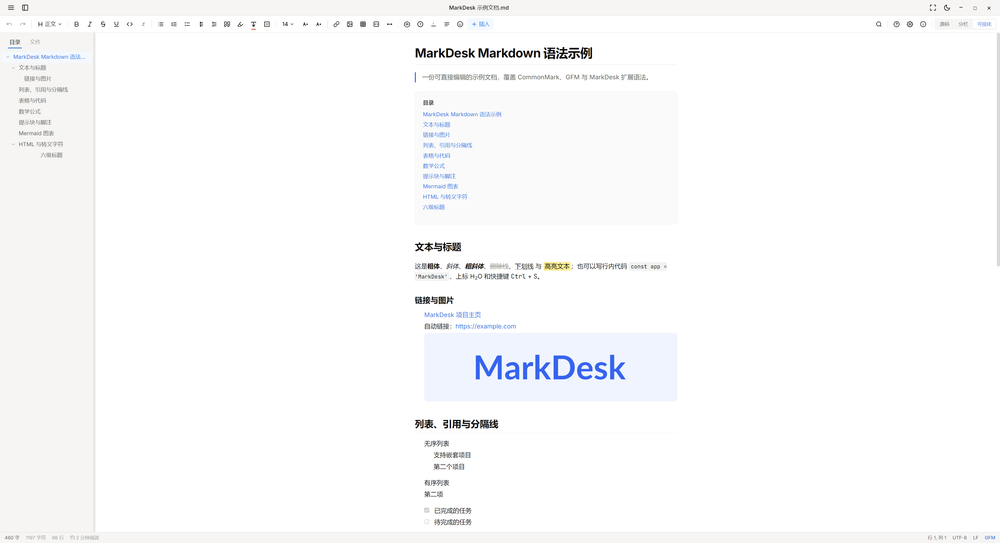

<p align="center">
  
</p>

<h1 align="center">MarkDesk</h1>

<p align="center">
  <strong>A calm, capable Markdown desk for Windows.</strong><br />
  Write in Markdown · shape the rendered document directly · keep every file local.
</p>

<p align="center">
  <a href="README.zh-CN.md">简体中文</a> ·
  <a href="#-quick-start">Quick Start</a> ·
  <a href="#-why-markdesk">Why MarkDesk?</a> ·
  <a href="#-contributing">Contributing</a>
</p>

<p align="center">
  
  
  
</p>

<p align="center">
  
</p>

## ✨ Why MarkDesk?

Markdown is wonderfully portable, but source-only editors can interrupt the flow of writing. MarkDesk gives you both worlds in one focused desktop app: clean source text when you want precision, and a visual document when you want to think on the page.

| ✍️ Write your way | 🔒 Keep it yours | 🪟 Feel at home on Windows |
| --- | --- | --- |
| Switch between source, split, and visual editing whenever the task changes. | No account, cloud sync, or server-side document processing. | Native file picker, standard window controls, themes, focus mode, and Markdown file associations. |

## 🚀 Features

- **↔️ Two-way editing** — edit Markdown source or the rendered document; changes stay synchronized.
- **🧭 Navigate long documents** — a live outline jumps precisely to the matching heading.
- **🧩 Rich Markdown, without the clutter** — CommonMark, GFM tables and task lists, syntax highlighting, KaTeX, Mermaid, callouts, footnotes, highlights, underline, and `[TOC]`.
- **🖼️ Local image workflow** — choose an image with the native picker; relative image paths render directly in Markdown documents.
- **🌗 Comfortable writing** — light and dark themes, focus mode, keyboard shortcuts, search and replace, word statistics, and synchronized scrolling.
- **📁 Open files naturally** — associate `.md`, `.markdown`, and `.mdx` files with MarkDesk after installation.

## ⚡ Quick Start

### Install the Windows app

Download and run the latest Windows installer from the project releases. Once installed, you can open Markdown files from File Explorer with MarkDesk.

### Run from source

> Node.js 18 or later is required.

```bash
git clone https://github.com/kalen2482/MarkDesk.git
cd MarkDesk
npm install
npm run dev
```

### Build a Windows installer

```bash
npm run build
npm run dist:win
```

### Build on macOS or Linux

MarkDesk uses Electron and can be built on macOS and Linux from the same source tree. Install Node.js 18+, then run:

```bash
npm install
npm run build
```

To produce distributables, run `electron-builder` on the target operating system (macOS for `.dmg`, Linux for AppImage/deb/rpm). Cross-platform signing and notarization require the appropriate platform credentials.

## 🛠️ Built with

| Purpose | Technology |
| --- | --- |
| Desktop runtime | Electron |
| Interface | React + TypeScript |
| Build tooling | Vite |
| Styling | Tailwind CSS |
| Markdown rendering | marked + highlight.js |
| Math and diagrams | KaTeX + Mermaid |
| HTML sanitization | DOMPurify |
| Windows packaging | electron-builder + NSIS |

## 🔐 Privacy by design

MarkDesk does not upload document content to a cloud service. Documents are read and written locally. External links or externally hosted images in a document may still make network requests when opened; use local resources for a fully offline workflow.

## 🤝 Contributing

Ideas, bug reports, and pull requests are welcome. For code changes, please explain the problem being solved and run `npm run build` before opening a pull request.

## 🤖 AI-assisted development

MarkDesk is developed with AI-assisted engineering workflows. Human maintainers define the product direction, review changes, test builds, and make the final release decisions.

## 📄 License

MarkDesk is released under the [Apache License 2.0](LICENSE).
