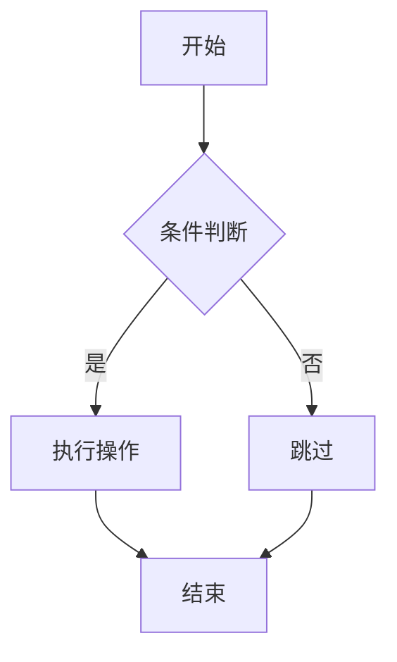

# 双向同步编辑器测试

## 1. 基本文本格式

这是一段普通文本，包含**加粗文字**、*斜体文字*、~~删除线~~、`行内代码`和__下划线__。

==这段文字被高亮标记==。

## 2. 列表

### 无序列表

- 第一项
- 第二项
  - 嵌套项 A
  - 嵌套项 B
- 第三项

### 有序列表

1. 步骤一
2. 步骤二
3. 步骤三

### 任务列表

- [x] 已完成的任务
- [ ] 未完成的任务
- [ ] 另一个待办

## 3. 引用块

> 这是一段引用文字。
> 可以有多行。

## 4. 数学公式

行内公式：$E = mc^2$，这是爱因斯坦的质能方程。

块级公式：

$$
\int_0^1 x^2 \, dx = \frac{1}{3}
$$

## 5. Mermaid 图表



## 6. Callout 提示框

> [!INFO]
> 这是一个信息提示框，用于展示一般性信息。

> [!WARNING]
> 这是一个警告提示框，需要注意潜在风险。

> [!TIP]
> 这是一个小技巧提示，帮助用户更好地使用功能。

## 7. 代码块

```typescript
function greet(name: string): string {
  return `Hello, ${name}!`
}
console.log(greet('MarkDesk'))
```

## 8. 表格

| 功能 | 源码模式 | 分栏模式 | 可视化模式 |
|------|---------|---------|-----------|
| 编辑 Markdown | ✅ | ✅ | ✅ |
| 实时预览 | ❌ | ✅ | ✅ |
| 可视化编辑 | ❌ | ✅ | ✅ |
| 拖拽调整 | ❌ | ✅ | ❌ |

## 9. 脚注

这里有一个脚注引用[^1]，还有另一个脚注[^2]。

[^1]: 这是第一个脚注的内容。
[^2]: 这是第二个脚注的内容。

## 10. 目录

[TOC]

## 11. 分割线与图片

---


---

## 验证步骤

### 步骤一：源码模式验证
1. 打开此文件，切换到「源码」模式
2. 确认所有 Markdown 语法正确显示
3. 在编辑区修改任意文字，保存

### 步骤二：分栏模式双向同步
1. 切换到「分栏」模式
2. 在左侧编辑区修改文字 → 右侧预览实时更新
3. 在右侧预览区直接编辑文字（如修改标题）→ 左侧源码自动更新
4. 验证修改后切换回源码模式，Markdown 格式正确

### 步骤三：可视化模式编辑
1. 切换到「可视化」模式（Ctrl+Shift+V）
2. 直接在预览区编辑文本（如修改段落文字、标题）
3. 切回源码模式，确认 Markdown 输出干净正确

### 步骤四：扩展语法验证
1. 在可视化模式下，确认以下元素正常显示但不被意外编辑：
   - Mermaid 图表（SVG 渲染）
   - KaTeX 公式（行内和块级）
   - Callout 提示框
   - 脚注引用
   - 目录(TOC)
2. 在可视化模式修改 Callout 内的文字 → 切回源码模式确认 Callout 语法完整
3. 在源码模式修改 Mermaid 代码 → 切回可视化模式确认图表重新渲染

### 步骤五：循环同步验证
1. 在分栏模式快速交替编辑左右两侧
2. 确认不会出现同步死锁或内容闪烁
3. 撤销(Ctrl+Z)/重做(Ctrl+Y)在两种编辑方式下都正常工作

### 步骤六：导出验证
1. 在可视化模式编辑后，导出为 Markdown
2. 用 Obsidian 或 Typora 打开导出的 .md 文件
3. 确认所有格式（公式、图表、Callout、脚注等）完整保留
